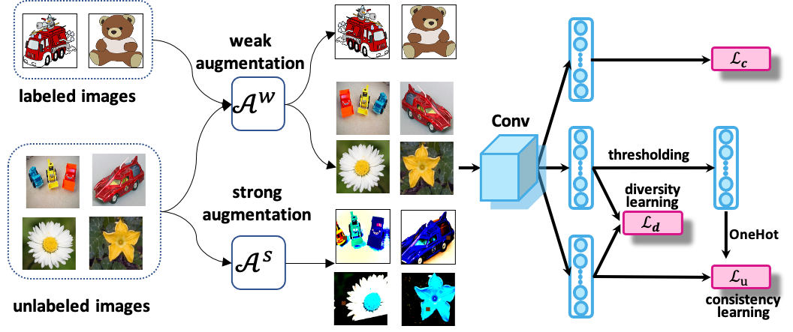

# SSHT
"SSHT" (Semi-supervised Source Hypothesis Transfer.)  
Paper: [Learning Invariant Representation with Consistency and Diversity for Semi-supervised Source Hypothesis Transfer](https://arxiv.org/abs/2107.03008)

# Environment
- pytorch=1.2.0
- torchvision=0.4.0
- python3.7
- cuda10

If you use conda, just run the following:
```
conda install pytorch==1.2.0 torchvision==0.4.0 cudatoolkit=10.0
```
# Dataset
Office-31 can be found [here](https://paperswithcode.com/dataset/office-31).    
Office-Home can be found [here](https://www.hemanthdv.org/officeHomeDataset.html).  
DomainNet can be found [here](http://ai.bu.edu/M3SDA/).  
Visda-2017 can be found [here](https://github.com/VisionLearningGroup/taskcv-2017-public).  
Here, we provide the [label lists](https://github.com/Wang-xd1899/SSHT/tree/main/data/txt) for the above datasets, for UDA, SSDA (1 shot and 3 shot).
# Train and Test
Please refer [run_sh.md](https://github.com/Wang-xd1899/SSHT/blob/main/run_sh.md). 
# Citation
If you use this code for your research, please consider citing:
```
@article{wang2021learning,
  title={Learning Invariant Representation with Consistency and Diversity for Semi-supervised Source Hypothesis Transfer},
  author={Wang, Xiaodong and Zhuo, Junbao and Cui, Shuhao and Wang, Shuhui},
  journal={arXiv preprint arXiv:2107.03008},
  year={2021}
}
```
# Contact
If you have any question, contact to me:  
- wangxd220@gmail.com

